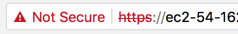

# Wordpress
This Wordpress install is a based on a collection of optimized Docker images from [Nginx](https://github.com/openbridge/nginx), [PHP-FPM](https://github.com/openbridge/ob_php-fpm), MariaDB and Redis. Combined they create a high performance, optimized environment for Wordpress which provides reliability, security, and scale.

## Features

[Nginx](https://github.com/openbridge/nginx), [PHP-FPM](https://github.com/openbridge/ob_php-fpm), MariaDB and Redis have been combined to deliver the following features:

* Reverse Proxy
* SEO optimizations
* Customizable configurations
* SSL with support for Lets Encrypt SSL certificates
* Mime-type based caching
* Redis LRU cache
* Fastcgi cache
* Proxy cache
* tmpfs file cache
* Brotli and Gzip compression
* Redirects for moved content
* [Security & Bot Protection](https://github.com/mitchellkrogza/nginx-ultimate-bad-bot-blocker)
* Monitoring processes, ports, permissions... with Monit
* Standardized UID/GID and Permissions (www-data)
* Support GeoIP
* Rate limited connections to slow down attackers
* CDN support
* Cache purge
* Opcache
* Pair with [high performance PHP-FPM container](https://github.com/openbridge/ob_php-fpm)

There are many, many other benefits to this system. Give it a try!

# Welcome! Your new Wordpress install
Congratulations! If you have launched the AMI you will have your default Wordpress site up and running in a few minutes. The address would look like this `https://ec2-22-123-98-217.compute-1.amazonaws.com` and display a default Wordpress install:


# Getting Started
There are still a few items remaining to configure your instance to suit your situation.

First, if you want to log into the `wp-admin` console, you need to get your password. You can get it from AWS console by looking at the `Get System Logs` and scrolling for `WORDPRESS_ADMIN_PASSWORD`. You can also SSH into your instance and get the creds (see below).

Second, we need to set your domain name and get your SSL setup. Your default install uses generic SSL certs that you need to replace.

## Configuring Your Environment
When you SSH into your server, in your `HOME` directory you will see a `wordpress.env` file that was created for you. This is used by your Docker containers to initialize their settings.

Here is what is resident in the file:

```
# Nginx Server
NGINX_SERVER_NAME=ec2-54-162-77-237.compute-1.amazonaws.com
NGINX_APP_PLUGIN=wordpress
NGINX_CONFIG=php
NGINX_DEV_INSTALL=
NGINX_DOCROOT=/usr/share/nginx/html

# Wordpress Settings
WORDPRESS_DB_PASSWORD=YechHICDZS3rhEAR41zeqnusIUxjJTew
WORDPRESS_DB_NAME=wordpress
WORDPRESS_DB_USER=wordpress
WORDPRESS_ADMIN=admin
WORDPRESS_VERSION=latest
WORDPRESS_ADMIN_PASSWORD=zPGW747e7XMazvt2
WORDPRESS_ADMIN_EMAIL=bob@gmail.com

# PHP Configuration
APP_DOCROOT=/usr/share/nginx/html
PHP_START_SERVERS=16
PHP_MIN_SPARE_SERVERS=8
PHP_MAX_SPARE_SERVERS=16
PHP_MEMORY_LIMIT=256
PHP_OPCACHE_ENABLE=1
PHP_OPCACHE_MEMORY_CONSUMPTION=96
PHP_MAX_CHILDREN=16

# Upstream Servers
WORDPRESS_DB_HOST=mariadb:3306
WORDPRESS_REDIS_HOST=redis:6379
NGINX_PROXY_UPSTREAM=localhost:8080
REDIS_UPSTREAM=redis:6379
PHP_FPM_UPSTREAM=php-fpm:9000
PHP_FPM_PORT=9000
```

There is only one you will need to edit, which is `NGINX_SERVER_NAME`. You will likely see the AWS default. We default to the name assigned by AWS which would look like `ec2-22-123-98-217.compute-1.amazonaws.com`. You need to change this to reflect your actual domain name (not the AWS one). You do this by setting `NGINX_SERVER_NAME`.

* `NGINX_SERVER_NAME` sets the default server name in `nginx.conf` and a few other locations. If you do not set this it will default to `localhost`. Typically this will be your domain name like `www.openbridge.com`. Note: Incorrectly setting a server name can create issues as many parts of the service rely on this matching your domain.

Also, you will also want to take note of the `WORDPRESS_ADMIN_PASSWORD`. This is the password you would use to login to Wordpress via the `wp-admin` console.
The default username is set via `WORDPRESS_ADMIN` and is `admin`.

As always, keep your ENV file safe and secure.


### Advanced Configuration
Don't change any of the defaults for these unless you are a pro and understand what you are doing:

* `NGINX_DOCROOT` sets the default www directory. The containers default to `/usr/share/nginx/html` so it is best left unchanged.
* `NGINX_CONFIG` sets the default configuration director for your image. See the `/conf` directory to review a `html` and `php` configuration. Since Wordpress is a PHP based application leave this as `php`.
* `PHP_FPM_UPSTREAM` sets the upstream server(s) to connect with to `php-fpm:9000`. The `PHP_FPM_PORT` should also remain unchanged as `PHP_FPM_PORT=9000`.
* `NGINX_PROXY_UPSTREAM` sets the upstream server(s) for the reverse proxy to connect with. Since the proxy is local to the container we use `localhost.com:8080`.
* `REDIS_UPSTREAM` sets the Redis LRU cache to `redis:6379`.
* The `WORDPRESS_DB_HOST` and `WORDPRESS_REDIS_HOST` mirror the same settings above. These will be `WORDPRESS_DB_HOST=mariadb:3306` and `WORDPRESS_REDIS_HOST=redis:6379`.

You can set a collection of dummy files and certs for local testing:
* `NGINX_DEV_INSTALL` Set to `true` if you want self-signed SSL certs installed and "hello world" HTML and PHP pages installed. This is useful for testing.
* NOTE: Self-signed SSL certificates are always installed if the system does not detect here in the default cert location at `/etc/letsencrypt/live/{NGINX_SERVER_NAME}/`

If the rest of the `wordpress.env` variables don't look familiar, don't touch them ;)


## Using WP-CLI to Manage Your Wordpress Install
WP-CLI is the command-line interface for WordPress. You can update plugins, configure multisite installs and much more, without using a web browser.

WP-CLI is installed at `/usr/bin/wp`. To run WP-CLI commands make sure you are located in the Wordpress root directory. In this case it is `/usr/share/nginx/html`

Here is just one example of using WP-CLI to activate plugins:
```bash
wp --allow-root plugin install amp antispam-bee nginx-helper wp-mail-smtp wordpress-seo redis-cache --activate
```
For a full list of commands, check out the [WP-CLI docs](https://developer.wordpress.org/cli/commands/).

## Configuring Your SSL Certificates
Your base Wordpress install comes with self-signed certs.



You will certainly want to change these.

### Understanding how SSL certs are organized

To keep things organized we default to using  [`letsencrypt`](https://letsencrypt.org/) for SSL certificates/keys, paths and naming conventions. Even if you are using your own certs, follow the naming conventions detailed below.

In keeping with the `letsencrypt` conventions make sure your certs are using the same naming scheme:
```
/etc/letsencrypt/live/${NGINX_SERVER_NAME}/;
├── server
│   ├── cert.pem
│   ├── chain.pem
│   ├── fullchain.pem
│   └── privkey.pem
```
The default locations for the SSL certs are in `/conf.d/ssl.conf`:
```nginx
ssl_certificate /etc/letsencrypt/live/{{NGINX_SERVER_NAME}}/fullchain.pem;
ssl_certificate_key /etc/letsencrypt/live/{{NGINX_SERVER_NAME}}/privkey.pem;
ssl_trusted_certificate /etc/letsencrypt/live/{{NGINX_SERVER_NAME}}/chain.pem;
```
Even if you are not using letsencrypt simple repurpose the path above.

## Installing `certbot` for `letsencrypt` SSL certs
On your **host**, not in the Docker image, install `certbot`:

* Download `certbot`: `curl -O https://dl.eff.org/certbot-auto`
* Set permissions:` chmod +x certbot-auto`
* Move the executable: `mv certbot-auto /usr/local/bin/certbot-auto`
* Generate your certificate: `/usr/local/bin/certbot-auto certonly -n --debug --agree-tos --email bob@gmail.com --standalone -d *.yourdomain.com`

If your run into an errors with certbot, trying running these commands:
```bash
rm -rf ~/.local/share/letsencrypt
rm -rf /opt/eff.org/*
pip install -U certbot
#try this
/usr/local/bin/certbot-auto certonly -n --debug --agree-tos --pre-hook="docker stop nginx" --post-hook="docker start nginx" --standalone -d *.yourdomain.com > /dev/null
# or this
certbot renew --debug
```
Certbot seems to be sensitive to OS and python updates and removing these files has helped clear up issues in the past.


### Mount Your Certs
You mount your certs directory on the host to the certs: `/etc/letsencrypt/live/<yourdomain>`.

With your certs on you host, add the paths to the Docker compose file under the `nignx` block. Here is the where you can find the file: `/home/ec2-user/wordpress.yml`

You will already see `- wordpress_data:/usr/share/nginx/html` present. You want to add the following into the compose file. Remember to put use the actual domain you used with certbot:

```docker
volumes:
  - wordpress_data:/usr/share/nginx/html
  - /etc/letsencrypt/live/<yourdomain>/fullchain.pem:/etc/letsencrypt/live/<yourdomain>/fullchain.pem
  - /etc/letsencrypt/live/<yourdomain>/privkey.pem:/etc/letsencrypt/live/<yourdomain>/privkey.pem
  - /etc/letsencrypt/live/<yourdomain>/chain.pem:/etc/letsencrypt/live/<yourdomain>/chain.pem
```

If you do not have a `chain.pem`, simply copy the `fullchain.pem` over.

```bash
cp /etc/letsencrypt/live/<yourdomain>/fullchain.pem  /etc/letsencrypt/live/<yourdomain>/chain.pem
```

### Automate SSL renewals
You will need to setup a renewal process. The docs say check twice a day for changes. Lets add the renewal process to cron:
```bash
cat << EOF > /tmp/crontab.conf
55 4,16 * * * /opt/eff.org/certbot/venv/local/bin/pip install --upgrade certbot
59 4,16 * * * /usr/local/bin/certbot-auto certonly -n --debug --agree-tos --pre-hook="docker stop nginx" --post-hook="docker start nginx" --standalone -d *.openbridge.com > /dev/null
EOF
```

Lastly, add everything to cron via `cat /tmp/crontab.conf | crontab - && crontab -l`

# Customization
This Wordpress services builds upon the community (free) versions of our Nginx and PHP-FPM containers. You are free to customize these services and this Wordpress service as you feel is appropriate. However, we can only provide support to systems that use the default installs.

Looking for customizations, configuration or enhancement based on your specific requirements? here are a few example engagements:

* Performance Audit / Consult
* Plugin Configuration
* Docker optimizations
* Elastic Load Balancers
* SSL Performance Setup
* CDN Configuration: Full-Site Delivery
* Hosting Environment Troubleshooting
* Redis, PHP-FPM Clustering
* Using Amazon RDS
* Backups
* Investigate compatibility issues

Contact us and we are happy to discuss a professional services engagement.

# Logs
You will likely want to dispatch  logs to a service like Amazon Cloudwatch. This will allow you to setup alerts and triggers to perform tasks based on container activity.

# Versioning
| Docker Tag | AMI ID | AMI Version | Alpine Version |
|-----|-------|-----|--------|
| latest | xxxx | 1.0.0 | edge |


# Issues

If you have any problems with or questions about this image, please contact us through a GitHub issue.

# Contributing

You are invited to contribute new features, fixes, or updates, large or small; we are always thrilled to receive pull requests, and do our best to process them as fast as we can.

Before you start to code, we recommend discussing your plans through a GitHub issue, especially for more ambitious contributions. This gives other contributors a chance to point you in the right direction, give you feedback on your design, and help you find out if someone else is working on the same thing.

# References

Lets Encrypt References

* https://www.digitalocean.com/community/tutorials/how-to-secure-nginx-with-let-s-encrypt-on-ubuntu-14-04
* https://git.daplie.com/Daplie/nodejs-self-signed-certificate-example/blob/master/make-root-ca-and-certificates.sh
* https://letsencrypt.org/

Wordpress
* https://www.digitalocean.com/community/tutorials/how-to-install-wordpress-and-phpmyadmin-with-docker-compose-on-ubuntu-14-04

Cache
* https://github.com/openresty/redis2-nginx-module#readme
* https://deliciousbrains.com/page-caching-varnish-vs-nginx-fastcgi-cache-2018/
* https://www.nginx.com/resources/wiki/modules/sr_cache/
* https://www.nginx.com/blog/benefits-of-microcaching-nginx/
* https://www.howtoforge.com/why-you-should-always-use-nginx-with-microcaching
* https://dzone.com/articles/the-benefits-of-microcaching-with-nginx

PHP

* https://www.kinamo.be/en/support/faq/determining-the-correct-number-of-child-processes-for-php-fpm-on-nginx
* https://www.if-not-true-then-false.com/2011/nginx-and-php-fpm-configuration-and-optimizing-tips-and-tricks/
* https://www.tecklyfe.com/adjusting-child-processes-php-fpm-nginx-fix-server-reached-pm-max_children-setting/
* https://serversforhackers.com/video/php-fpm-process-management
* https://devcenter.heroku.com/articles/php-concurrency

# License

This project is licensed under the MIT License - see the [LICENSE](LICENSE) file for details
