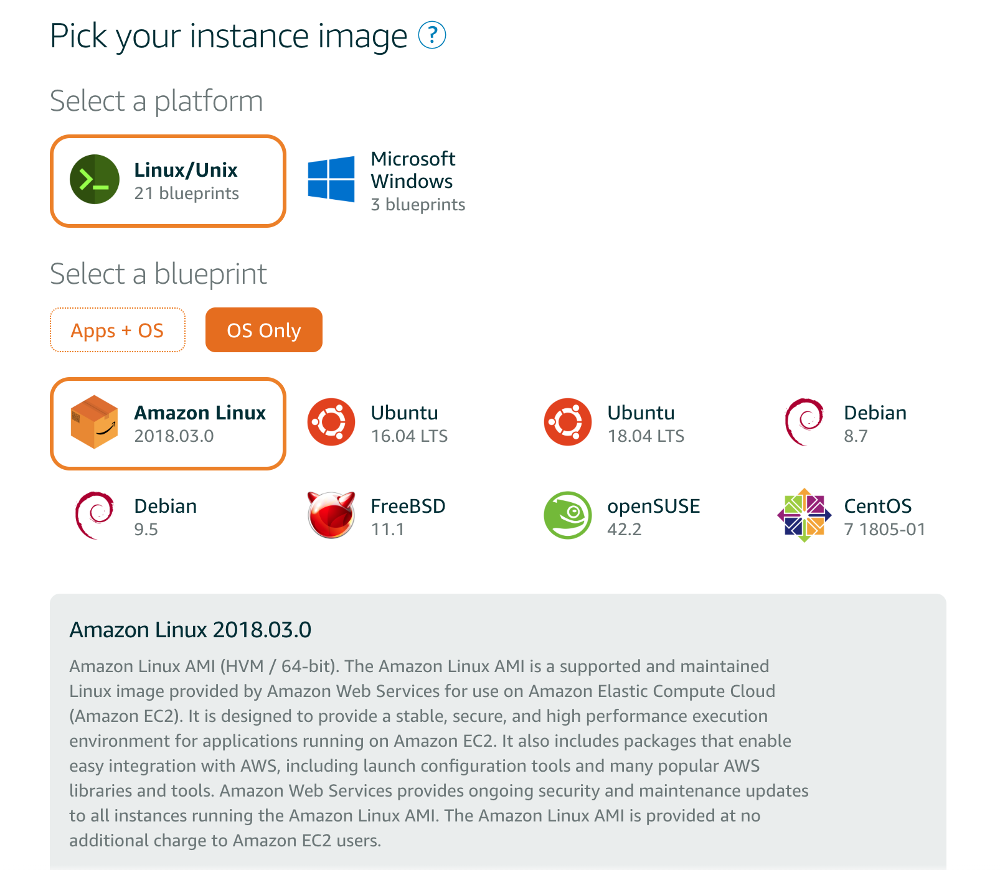
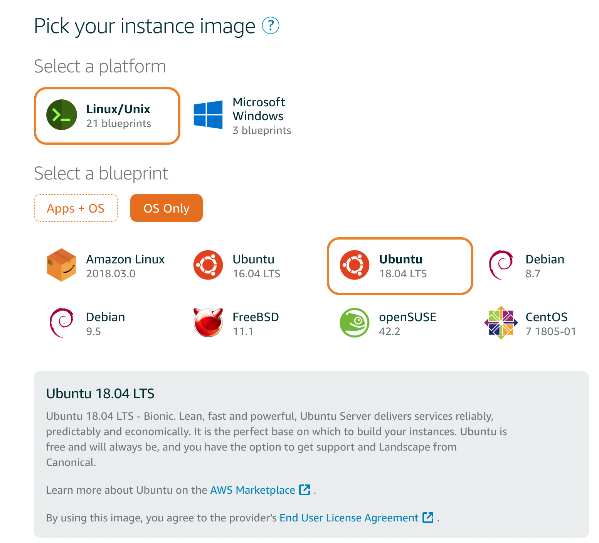
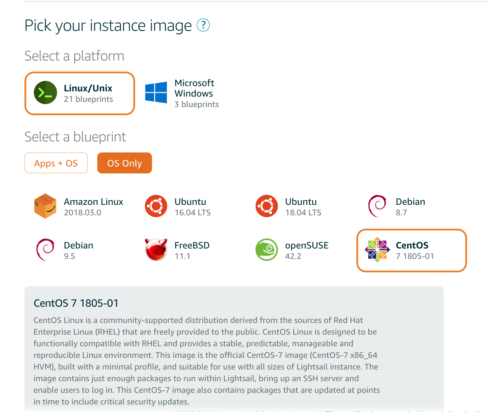
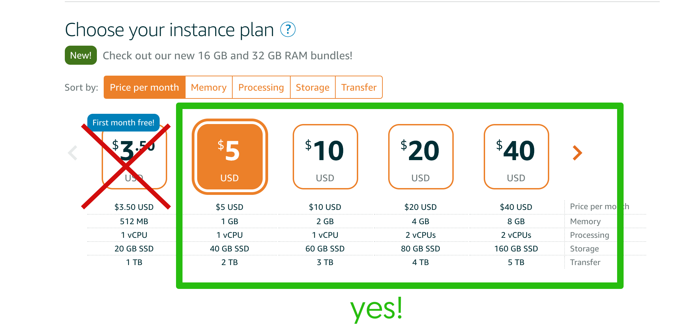
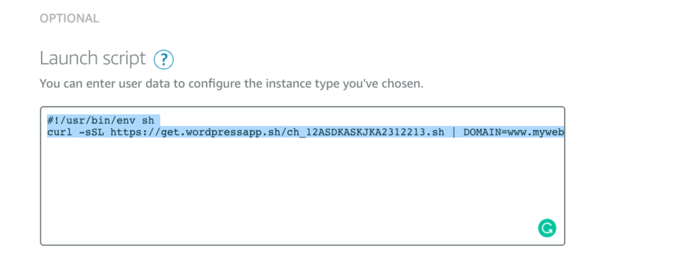
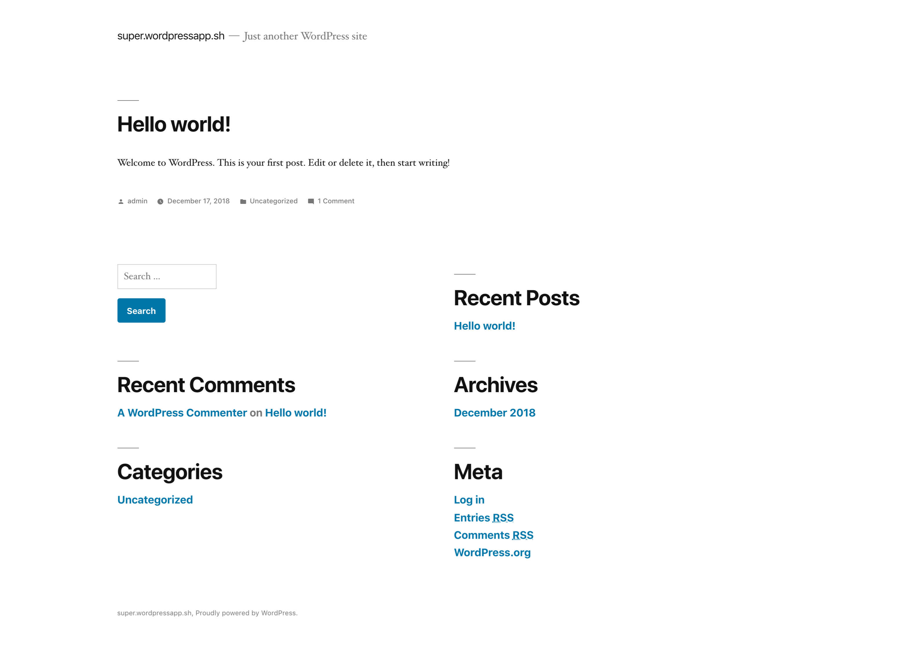
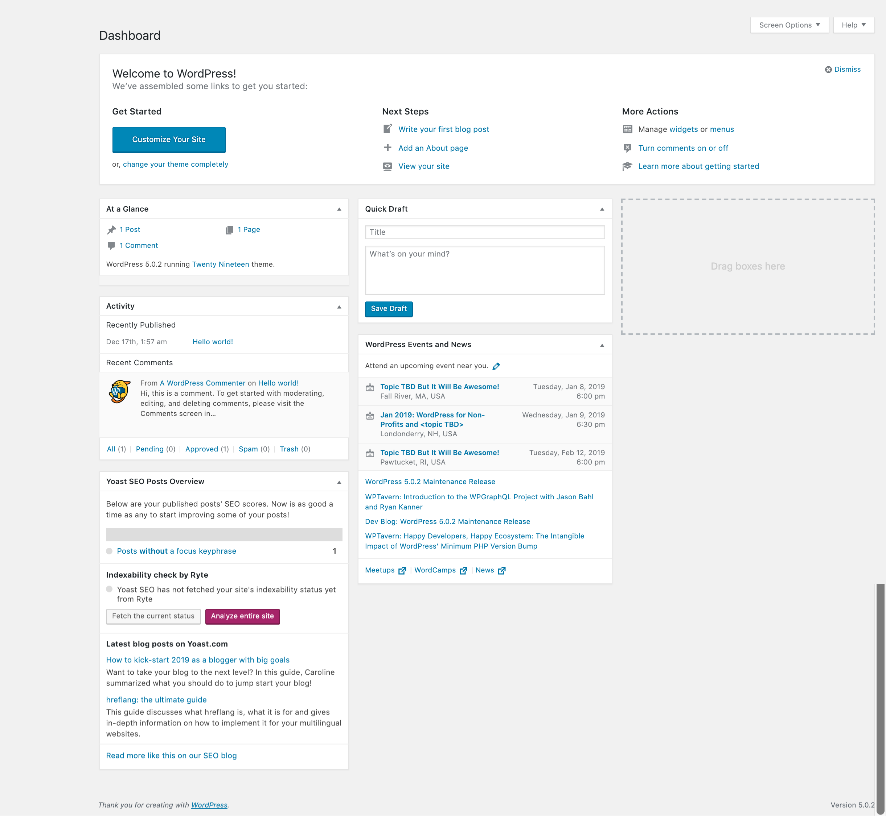
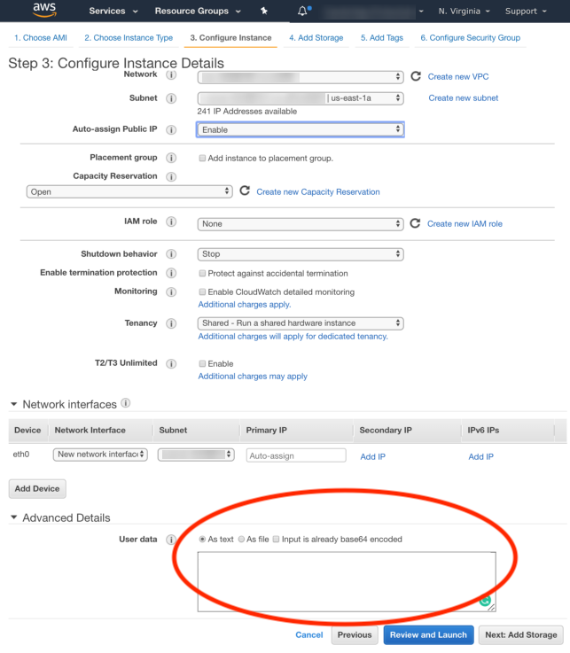
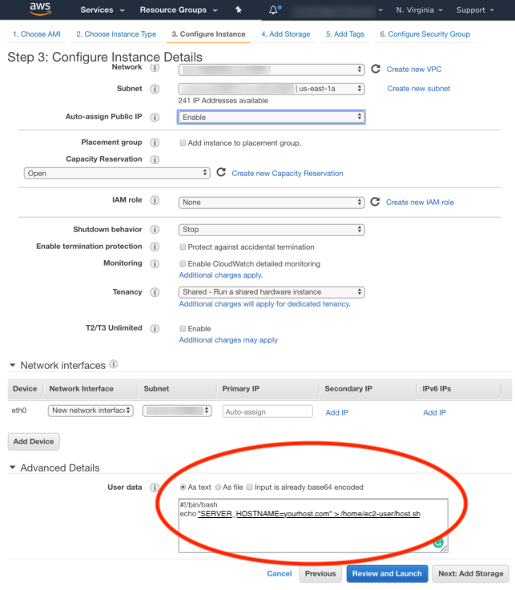

# Docker WordPress 5 with Nginx, PHP-FPM, MariaDB and Redis

* Are you tired of slow, inefficient WordPress hosts?
* Struggling with barebones *"default"* installs that leave all the tweaking and optimizations to figure out?
* Frustrated with slow page loading time and slow server response times?
* Dealing with missing functions, a plugin blacklist and limits on customizations or themes?
* Annoyed by having to use an army of cache plugins to get a functioning site?
* Sick of being in a shared server with a dozen other WordPress sites?

**This is a perfect opportunity to get a WordPress Stack that provides an automated, super fast solution for those who to maximize performance and prefer dedicated WordPress installs**.


##  Why the Openbridge Wordpress Stack?
Our high-performance WordPress micro-services stack is based on lightweight, secure, up-to-date, and highly optimized set Docker services. We fuse a best of breed collection of Docker services from [NGINX](https://github.com/openbridge/nginx), [PHP-FPM](https://github.com/openbridge/ob_php-fpm), MariaDB and Redis. Together they create a performance driven, flexible environment that delivers reliability, security, and scale.

Powerful NGINX and PHP optimizations ensure optimal WordPress performance, reducing or eliminating the need of WordPress plugins that create unnecessary overhead. As a result you can easily serve millions of requests a day with minimal CPU, RAM and disk resources.

This is the only WordPress service that combined [Nginx](https://github.com/openbridge/nginx), [PHP-FPM](https://github.com/openbridge/ob_php-fpm), MariaDB and Redis have been combined to deliver the following features:

* Reverse Proxy
* SEO optimizations
* Customizable configurations
* SSL with support for Lets Encrypt SSL certificates
* Mime-type based caching
* Redis LRU cache
* Fastcgi cache
* Proxy cache
* tmpfs file cache
* Brotli and Gzip compression
* Redirects for moved content
* [Security & Bot Protection](https://github.com/mitchellkrogza/nginx-ultimate-bad-bot-blocker)
* Builtin monitoring of processes, ports, permissions... with [Monit](https://mmonit.com/)
* Standardized UID/GID and Permissions (www-data)
* Support GeoIP
* Rate limited connections to slow down attackers
* CDN support
* Cache purge
* Opcache
* Paired with [high performance PHP-FPM container](https://github.com/openbridge/ob_php-fpm)
* Cerbot
* ACME: The simplest shell script for Let's Encrypt free certificate client (https://github.com/Neilpang/acme.sh)

There are many, many other benefits to this system. Give it a try!


# User Guide

- [Getting Started](#getting-started)
	- [Step 1: Order Your Wordpress Installer](#step-1-order-your-wordpress-installer)
	- [Step 2: Getting Your Hosting Environment Setup](#step-2-getting-your-hosting-environment-setup)
	- [Step 3: Launch Your Server](#step-3-launch-your-server)
	- [Step 4: Welcome! Your new WordPress install is activated](#step-4-welcome-your-new-wordpress-install-is-activated)
- [Frequently Asked Questions](#frequently-asked-questions)
	- [Why do I need to setup DNS or a Domain name?](#why-do-i-need-to-setup-dns-or-a-domain-name)
	- [What is the `wordpress.env` file?](#what-is-the-wordpressenv-file)
	- [Only change these if you know what you are doing](#only-change-these-if-you-know-what-you-are-doing)
	- [Where do I set `USERDATA`?](#where-do-i-set-userdata)
	- [I'm using the Amazon Marketplace AMI. How do I set the `USERDATA` for it?](#im-using-the-amazon-marketplace-ami-how-do-i-set-the-userdata-for-it)
	- [I see "Not Secure" in my browser](#i-see-not-secure-in-my-browser)
	- [How are SSL certs organized?](#how-are-ssl-certs-organized)
	- [How does NGINX know where to find the SSL certs?](#how-does-nginx-know-where-to-find-the-ssl-certs)
	- [Can I manually run `certbot` for `letsencrypt` SSL certs?](#can-i-manually-run-certbot-for-letsencrypt-ssl-certs)
	- [Can I automate `letsencrypt` SSL renewals](#can-i-automate-letsencrypt-ssl-renewals)
	- [Do you already have SSL certs from another source?](#do-you-already-have-ssl-certs-from-another-source)
	- [Editing the `wordpress.yml`](#edit-wordpressyml)
	- [How do I Start and Stop Docker Services](#how-do-i-start-and-stop-docker-services)
	- [Can I use WP-CLI to manage my WordPress install?](#can-i-use-wp-cli-to-manage-my-wordpress-install)
	- [I got a `Bad Gateway` error. What does that mean?](#i-got-a-bad-gateway-error-what-does-that-mean)
- [Customization](#customization)
- [Logs](#logs)
- [Versioning](#versioning)
- [Issues](#issues)
- [Contributing](#contributing)
- [References](#references)
- [License](#license)

<!-- /TOC -->

# Getting Started

## Step 1: Order Your Wordpress Installer
First, you need to order your installer. You can get that here!

<a href="http://get.wordpressapp.sh">
</a>
### Your Installer
Once your order is complete you will receive an installer link. It will have the following format:
```bash
curl -sSL https://get.wordpressapp.sh/<your-token>.sh | DOMAIN=<yourdomain> sh
```
You will notice two parts to your WordPress installer link. The first part is is `<your-token>.sh`. The token reflects your specific purchase key. We will automatically create a unique token for your installer. The final link will look like this:

```bash
curl -sSL https://get.wordpressapp.sh/ch_12ASDKASKJKA2312213.sh | DOMAIN=<yourdomain> sh
```
Next, you will need to add your actual domain name. This means `DOMAIN=` should reference DNS you attached to your IP address. Replace the placeholder with your actual domain. It should look like this:
```bash
curl -sSL https://get.wordpressapp.sh/ch_12ASDKASKJKA2312213.sh | DOMAIN=www.mywebsite.com sh
```
All set? Lets move to **Step 2** and get your hosting environment setup

## Step 2: Getting Your Hosting Environment Setup
Within your hosting provider, make sure you have done some preparation in advance of running the installer. The following are three key areas to care for:

*  **IP and DNS**: Make sure your IP address and domain name are configured. This means the DNS you are using can get resolved to an IP address. If this is not setup, the `Letsencrypt` process **will not** be able to provision your SSL certs. The installer will fallback to self-signed SSL certs. If your IP (x.x.x.x) does not point to a DNS A Record ( `yourhost.com` or `www.yourhost.com` ) then you will need to manually adjust this later.

*  **Host Operating System**: The installer will work with CentOS 7 x64, Amazon Linux 1/2 x64 and Ubuntu 18/16 x64. Ideally for CentOS you will use the latest release. The same is for Ubuntu. For Amazon Linux, you can use Amazon Linux or Amazon Linux 2. here are some examples of using Amazon Lightsail:

Amazon Linux




Ubuntu



CentOS



*  **Firewall**: Make sure ports `80` and `443` are open. Also, if you SSH into your server make sure `22` is also open.

* **Server Ram**: We suggest a server with no less than **1 GB** of ram. Can things run with 512 MB, yes. However, there is a risk of hitting memory constraints. The difference between an instance with 512 MB of ram and one with 1 GB of ram on Amazon Lightsail is **$1.50** USD a month. Let's put it this way, the risk of hitting memory limits is not worth $1.50 in savings you might realize.



All set with these? You are ready to move to **Step 3**.

## Step 3: Launch Your Server
Within your preferred hosting provided, launch a server instance that will host WordPress. Remember, make sure the server meets prerequisites we listed earlier for operating system, memory, firewall and DNS.

### Running Your Installer
There are two options for running the WordPress installer:

* **A**: `USERDATA`: preloading the installer via your hosting provider admin console `USERDATA` function
* **B**: `SSH`: connecting to your server via `SSH` and running the installer via command line

### A. `USERDATA` Approach
If your hosting provider supports `USERDATA` you can simply cut and paste your installer into the form field they provide. We normally suggest setting `#!/usr/bin/env sh` in the first line to properly set the runtime context for the installer. This is an example:

```sh
#!/usr/bin/env sh
curl -sSL https://get.wordpressapp.sh/ch_12ASDKASKJKA2312213.sh | DOMAIN=www.mywebsite.com sh
```

Here is what it looks like within Lightsail:


Thats it! When your host provisions the server the installer will get run automatically. Once complete, your server will be ready to go!

For reference, here are Amazon and Digital Ocean describe the `USERDATA` process in more detail:

* [Amazon: Running Commands on Your Linux Instance at Launch](https://docs.aws.amazon.com/AWSEC2/latest/UserGuide/user-data.html)
* [Digital Ocean: An Introduction to Droplet Metadata](https://www.digitalocean.com/docs/droplets/resources/metadata/)


**Note:** `USERDATA` ONLY applies when launching your server the first time, not during a start/stop of an instance.

Are you using the Amazon Marketplace image?

Take me to [Amazon AMI instructions](## I'm using the Amazon Marketplace AMI. How do I set the `USERDATA` for it?)


### B. `SSH` Approach
Is the use of `USERDATA` required? NO! You can `SSH` your server and run the same command:

```bash
[root@ip-222-21-2-11 ec2-user]: curl -sSL https://get.wordpressapp.sh/<your-token>.sh | DOMAIN=<yourdomain> sh
```

### NOTE: Timing to complete the install...

The installer needs configure the host, download a set of Docker images, Wordpress and connect to Letsencrypt. It will take from 1-5 minutes to complete the full install process depending on the instance type and network latency.


## Step 4: Welcome! Your new WordPress install is activated
**Congratulations!** If you have run the installer you will have your default WordPress site up and running in a few minutes.

To verify your server is active visit the test page here: `https://yourhost.com/index.html`. If you did not set a domain, use the default Amazon EC2 address would look like this: `https://ec2-22-123-98-217.compute-1.amazonaws.com/index.html`

Once your WordPress install is complete, or if you set your hostname via `USERDATA`, then you can connect to it like `https://yourhost.com`.

**Note:** You will want to delete the test `index.html`.

The default WordPress 5 install visually looks like:



If you want to log into the `wp-admin` console, you need to get your password. You can also get it from AWS console by looking at the `Get System Logs` and scrolling for `WORDPRESS_ADMIN_PASSWORD`. You can also SSH into your instance and get the creds. You can also SSH into your instance. The user/pass is located in a file called `wordpress-login.txt`. You will likely want to change this and remove the `wordpress-login.txt` after your first login.



# Frequently Asked Questions

## Why do I need to setup DNS or a Domain name?
We require you use the a domain (`yourhost.com` or `www.yourhost.com`). This will ensure that everything is correctly auto configured on your behalf. For example, if you set `www.yourhost.com` NGINX will set it a server as `www.yourhost.com`. Please note: The domain `yourhost.com` is a placeholder, an example, Do not blindly use `yourhost.com`!

Remember, if you decide *not* to set DNS in advance you will need to manually configure SSL. We will install self-signed SSL certs as a temporary solution until you can configure everything according to the process outlined below.

**DNS/IP setup must be done in advance of starting installer else the setup process and `letsencrypt` will not be able to resolve the name to your instance.**. In this example we pasted the IP address as an A record for our target domain like this:


## What is the `wordpress.env` file?
When you SSH into your server go to your `HOME` directory. In there you will see a `wordpress.env` file that was created for you. This is used by your Docker containers to initialize various container settings.

Here is what is resident in the file:

```
# Nginx Server
NGINX_SERVER_NAME=ec2-54-162-77-237.compute-1.amazonaws.com or yourhost.com
NGINX_APP_PLUGIN=WordPress
NGINX_CONFIG=php
NGINX_DEV_INSTALL=
NGINX_DOCROOT=/usr/share/nginx/html

# WordPress Settings
WORDPRESS_DB_PASSWORD=YechHICDZS3rhEAR41zeqnusIUxjJTew
WORDPRESS_DB_NAME=WordPress
WORDPRESS_DB_USER=WordPress
WORDPRESS_ADMIN=admin
WORDPRESS_VERSION=latest
WORDPRESS_ADMIN_PASSWORD=zPGW747e7XMazvt2
WORDPRESS_ADMIN_EMAIL=bob@gmail.com

# PHP Configuration
APP_DOCROOT=/usr/share/nginx/html
PHP_START_SERVERS=16
PHP_MIN_SPARE_SERVERS=8
PHP_MAX_SPARE_SERVERS=16
PHP_MEMORY_LIMIT=256
PHP_OPCACHE_ENABLE=1
PHP_OPCACHE_MEMORY_CONSUMPTION=96
PHP_MAX_CHILDREN=16

# Upstream Servers
WORDPRESS_DB_HOST=mariadb:3306
WORDPRESS_REDIS_HOST=redis:6379
NGINX_PROXY_UPSTREAM=localhost:8080
REDIS_UPSTREAM=redis:6379
PHP_FPM_UPSTREAM=php-fpm:9000
PHP_FPM_PORT=9000
```

If you did not set DNS via `USERDATA` then there is only one place you will need to edit, which is `NGINX_SERVER_NAME`. You will likely see the AWS default. We default to the name assigned by AWS which would look like `ec2-22-123-98-217.compute-1.amazonaws.com`. You need to change this to reflect your actual domain name (not the AWS one). You do this by setting `NGINX_SERVER_NAME`.

* `NGINX_SERVER_NAME` sets the default server name in `nginx.conf` and a few other locations. If you do not set this it will default to `localhost`. Typically this will be your domain name like `www.openbridge.com`. Note: Incorrectly setting a server name can create issues as many parts of the service rely on this matching your domain.

Also, you will also want to take note of the `WORDPRESS_ADMIN_PASSWORD`. This is the password you would use to login to WordPress via the `wp-admin` console.
The default username is set via `WORDPRESS_ADMIN` and is `admin`.

As always, keep your ENV file safe and secure.

### Only change these if you know what you are doing
Don't change any of the defaults for these unless you are a pro and understand what you are doing:

* `NGINX_DOCROOT` sets the default www directory. The containers default to `/usr/share/nginx/html` so it is best left unchanged.
* `NGINX_CONFIG` sets the default configuration director for your image. See the `/conf` directory to review a `html` and `php` configuration. Since WordPress is a PHP based application leave this as `php`.
* `PHP_FPM_UPSTREAM` sets the upstream server(s) to connect with to `php-fpm:9000`. The `PHP_FPM_PORT` should also remain unchanged as `PHP_FPM_PORT=9000`.
* `NGINX_PROXY_UPSTREAM` sets the upstream server(s) for the reverse proxy to connect with. Since the proxy is local to the container we use `localhost.com:8080`.
* `REDIS_UPSTREAM` sets the Redis LRU cache to `redis:6379`.
* The `WORDPRESS_DB_HOST` and `WORDPRESS_REDIS_HOST` mirror the same settings above. These will be `WORDPRESS_DB_HOST=mariadb:3306` and `WORDPRESS_REDIS_HOST=redis:6379`.

You can set a collection of dummy files and certs for local testing:
* `NGINX_DEV_INSTALL` Set to `true` if you want self-signed SSL certs installed and "hello world" HTML and PHP pages installed. This is useful for testing.
* NOTE: Self-signed SSL certificates are always installed if the system does not detect here in the default cert location at `/etc/letsencrypt/live/{HOST}/`

If the rest of the `wordpress.env` variables don't look familiar, don't touch them ; )

## Where do I set `USERDATA`?

On Amazon it will look like this:



## Do you offer an Amazon Marketplace AMI?
Yes, the Amazon Marketplace AMI is here: https://aws.amazon.com/marketplace/pp/B07FCV1BPF

## I'm using the Amazon Marketplace AMI. How do I set the `USERDATA` for it?
Are you using our AWS AMI: https://aws.amazon.com/marketplace/pp/B07FCV1BPF? If so read on...

Setting `USERDATA` will set the host name in your AMI instance. If you do not set the `USERDATA`. we will use the instance host name set by AWS.

Make sure when launching your AMI you are setting this (replace "yourhost.com" with your actual domain)
```bash
#!/bin/bash
echo "SERVER_HOSTNAME=yourhost.com" > /home/ec2-user/host.sh
```

It will look like this:




## I see "Not Secure" in my browser
This happens if you forgot to setup or misconfigured the IP and DNS before running the installer
You need to set your domain name and get your SSL setup.


## How are SSL certs organized?
To keep things organized we default to using [`letsencrypt`](https://letsencrypt.org/) pathing and naming conventions. Even if you are using your own certs, follow the naming conventions detailed below.

In keeping with the `letsencrypt` conventions the certs are using this path and naming scheme:
```bash
/etc/letsencrypt/live/${NGINX_SERVER_NAME}/;
├── server
│   ├── cert.pem
│   ├── chain.pem
│   ├── fullchain.pem
│   └── privkey.pem
```
The path `/etc/letsencrypt/live` is on your host.  

lets assume your server name was `www.mywebsite.com`. The certs should be located here `/etc/letsencrypt/live/www.mywebsite.com/`

In the `wordpress.yml` file you need to make sure that pathing aligns. It should look like this:

```docker
volumes:
  - wordpress_data:/usr/share/nginx/html
  - /etc/letsencrypt/live/www.mywebsite.com/fullchain.pem:/etc/letsencrypt/live/www.mywebsite.com/fullchain.pem
  - /etc/letsencrypt/live/www.mywebsite.com/privkey.pem:/etc/letsencrypt/live/www.mywebsite.com/privkey.pem
  - /etc/letsencrypt/live/www.mywebsite.com/chain.pem:/etc/letsencrypt/live/www.mywebsite.com/chain.pem
```

## How does NGINX know where to find the SSL certs?

NGINX will look for the mounted certs according the path set in the `wordpress.yml`. This aligns with the the default locations for the SSL certs within Docker NGINX here `/etc/nginx/conf.d/ssl.conf`.
```nginx
ssl_certificate /etc/letsencrypt/live/www.mywebsite.com/fullchain.pem;
ssl_certificate_key /etc/letsencrypt/live/www.mywebsite.com/privkey.pem;
ssl_trusted_certificate /etc/letsencrypt/live/www.mywebsite.com/chain.pem;
```


## Can I manually run `certbot` for `letsencrypt` SSL certs?
On your **host**, not in the Docker image,  we pre-installed the `certbot` Docker image.

First, make sure your `NGINX` is not running. You need to do this because `cerbot` needs to have post 80 and 443 open. If `NGINX` is running, there will be a port conflict. This will gracefully close down everything:

```bash
/usr/local/bin/docker-compose -f /home/ec2-user/wordpress.yml down --remove-orphans
```

Next, provision your SSL certificates:

```bash
docker pull certbot/certbot

docker run -it --rm -p 80:80 -p 443:443 --name certbot -v "/etc/letsencrypt:/etc/letsencrypt" -v "/var/lib/letsencrypt:/var/lib/letsencrypt" certbot/certbot certonly -n --debug --agree-tos --email user@gmail.com --standalone -d ${SERVER_HOSTNAME}
```

Then start up all your services again:
```bash
/usr/local/bin/docker-compose -f /home/ec2-user/wordpress.yml up -d --remove-orphans
```
**NOTE**: `/home/ec2-user/` is the directory you ran the installer. Replace this with your actual directory. Normally this will be the HOME directory for the user account you used for the install. For example, for AWS it is likely that `/home/ec2-user/` may be the path. Just do not copy this blindly as it is dependent on your unique environment.

## Can I automate `letsencrypt` SSL renewals
Yes, you can setup a renewal process. The `letsencrypt` docs say check twice a day for changes. The the renewal process with cron will look something like this:
```bash
cat << EOF > /tmp/crontab.conf
55 4,16 * * * /opt/eff.org/certbot/venv/local/bin/pip install --upgrade certbot
59 4,16 * * * certbot-auto certonly -n --debug --agree-tos --pre-hook="docker stop nginx" --post-hook="docker start nginx" --standalone -d *.yourhost.com > /dev/null
EOF
```
Lastly, add everything to cron via `cat /tmp/crontab.conf | crontab - && crontab -l`

Here is another variant:
```bash
#!/usr/bin/env bash

# Stop Nginx first
docker kill nginx
# Run the renew function
docker run -it --rm -p 80:80 -p 443:443 --name certbot -v "/etc/letsencrypt:/etc/letsencrypt" -v "/var/lib/letsencrypt:/var/lib/letsencrypt" certbot/certbot renew
# Startup the service again
/usr/local/bin/docker-compose -f ./prod.yml up -d --remove-orphans
```

Depending on your Operating system, this may vary. Please do not copy as is. Test it first to make sure cron can run the process correctly within your host OS.

Check the docs to find an approach that works best for your host and OS: https://certbot.eff.org/docs/using.html

## Do you already have SSL certs from another source?
As we mentioned SSL certs are mounted from directory on the host to the NGINX container: `/etc/letsencrypt/live/<yourdomain>`. If you need to set SSL certs manually because you have them already via some other third party, then read on.

### Edit `wordpress.yml`
First, make sure you place your certs on the host in this path: `/etc/letsencrypt/live/<yourdomain>`.

Next, we want to add the path to your certs into the Docker compose `wordpress.yml` file. In the compose yml file see the SSL certs under the NGINX block. You want to add/edit the following into the compose file. Remember to put use the actual domain you want to use in place of `<yourdomain>`:

```bash
volumes:
  - wordpress_data:/usr/share/nginx/html
  - /etc/letsencrypt/live/<yourdomain>/fullchain.pem:/etc/letsencrypt/live/<yourdomain>/fullchain.pem
  - /etc/letsencrypt/live/<yourdomain>/privkey.pem:/etc/letsencrypt/live/<yourdomain>/privkey.pem
  - /etc/letsencrypt/live/<yourdomain>/chain.pem:/etc/letsencrypt/live/<yourdomain>/chain.pem
```

If you do not have a `chain.pem`, simply copy the `fullchain.pem` over.

```bash
cp /etc/letsencrypt/live/<yourdomain>/fullchain.pem  /etc/letsencrypt/live/<yourdomain>/chain.pem
```
After making the change to the compose file, save it. Then run this command to start everything:

```bash
/usr/local/bin/docker-compose -f /home/ec2-user/wordpress.yml up -d --remove-orphans
```


## How do I Start and Stop Docker Services

If you want to `start` all your services, the command is:
```bash
/usr/local/bin/docker-compose -f /home/ec2-user/wordpress.yml up -d --remove-orphans
```
If you want to `stop` all your services, the command is:
```bash
/usr/local/bin/docker-compose -f /home/ec2-user/wordpress.yml down --remove-orphans
```


## Can I use WP-CLI to manage my WordPress install?
Yes, WP-CLI is installed. It is the command-line interface for WordPress. You can update plugins, configure multisite installs and much more, without using a web browser.

WP-CLI is installed at `/usr/bin/wp`. To run WP-CLI commands make sure you are located in the WordPress root directory. In this case it is `/usr/share/nginx/html`

Here is just one example of using WP-CLI to activate plugins:
```bash
wp --allow-root plugin install amp antispam-bee nginx-helper wp-mail-smtp WordPress-seo redis-cache --activate
```
For a full list of commands, check out the [WP-CLI docs](https://developer.WordPress.org/cli/commands/).

## I got a `Bad Gateway` error. What does that mean?

If you happen to see a bad gateway error, hard reload your browser. It is possible you have something in your browser cache that is causing this OR the system is still installing the WordPress application. It can take up to 5-10 minutes after initializing your instance for the site to appear. Normally it is much faster than that, but depending on a variety of factors it is best to wait for everything to settle:


# Customization
This WordPress services builds upon the community (free) versions of our [NGINX](https://github.com/openbridge/nginx) and [PHP-FPM](https://github.com/openbridge/ob_php-fpm) images. You are free to customize these services and this WordPress service as you feel is appropriate. However, we can only provide support to systems that use the default installs.

Looking for customizations, configuration or enhancement based on your specific requirements? here are a few example engagements:

* Performance Audit / Consult
* Plugin Configuration
* Docker optimizations
* Elastic Load Balancers
* SSL Performance Setup
* CDN Configuration: Full-Site Delivery
* Hosting Environment Troubleshooting
* Redis, PHP-FPM Clustering
* Using Amazon RDS
* Backups
* Investigate compatibility issues

Contact us and we are happy to discuss a professional services engagement.

# Logs
You will likely want to dispatch logs to a service like Amazon Cloudwatch. This will allow you to setup alerts and triggers to perform tasks based on container activity.

# Versioning

## Wordpress Installer AMI
| Docker Tag  | Wordpress Installer | Alpine Version |
|-----|-------|--------|
| latest | 1.0.0 | 3.8 |

## Amazon Marketplace AMI
| Docker Tag | AMI ID | AMI Version | Alpine Version |
|-----|-------|-----|--------|
| latest | ami-deb3eea1 | 1.0.2 | 3.8 |
| latest | ami-deb3eea1 | 1.0.1 | 3.8 |


# Issues

If you have any problems with or questions about this image, please contact us through a GitHub issue.


# Contributing

You are invited to contribute new features, fixes, or updates, large or small; we are always thrilled to receive pull requests, and do our best to process them as fast as we can.

Before you start to code, we recommend discussing your plans through a GitHub issue, especially for more ambitious contributions. This gives other contributors a chance to point you in the right direction, give you feedback on your design, and help you find out if someone else is working on the same thing.

# References

Lets Encrypt References

* https://www.digitalocean.com/community/tutorials/how-to-secure-nginx-with-let-s-encrypt-on-ubuntu-14-04
* https://git.daplie.com/Daplie/nodejs-self-signed-certificate-example/blob/master/make-root-ca-and-certificates.sh
* https://letsencrypt.org/

WordPress
* https://www.digitalocean.com/community/tutorials/how-to-install-WordPress-and-phpmyadmin-with-docker-compose-on-ubuntu-14-04

Cache
* https://github.com/openresty/redis2-nginx-module#readme
* https://deliciousbrains.com/page-caching-varnish-vs-nginx-fastcgi-cache-2018/
* https://www.nginx.com/resources/wiki/modules/sr_cache/
* https://www.nginx.com/blog/benefits-of-microcaching-nginx/
* https://www.howtoforge.com/why-you-should-always-use-nginx-with-microcaching
* https://dzone.com/articles/the-benefits-of-microcaching-with-nginx

PHP

* https://www.kinamo.be/en/support/faq/determining-the-correct-number-of-child-processes-for-php-fpm-on-nginx
* https://www.if-not-true-then-false.com/2011/nginx-and-php-fpm-configuration-and-optimizing-tips-and-tricks/
* https://www.tecklyfe.com/adjusting-child-processes-php-fpm-nginx-fix-server-reached-pm-max_children-setting/
* https://serversforhackers.com/video/php-fpm-process-management
* https://devcenter.heroku.com/articles/php-concurrency

# License

This project is licensed under the MIT License - see the [LICENSE](LICENSE) file for details
